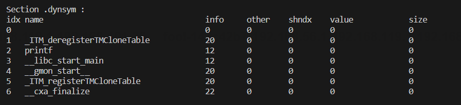
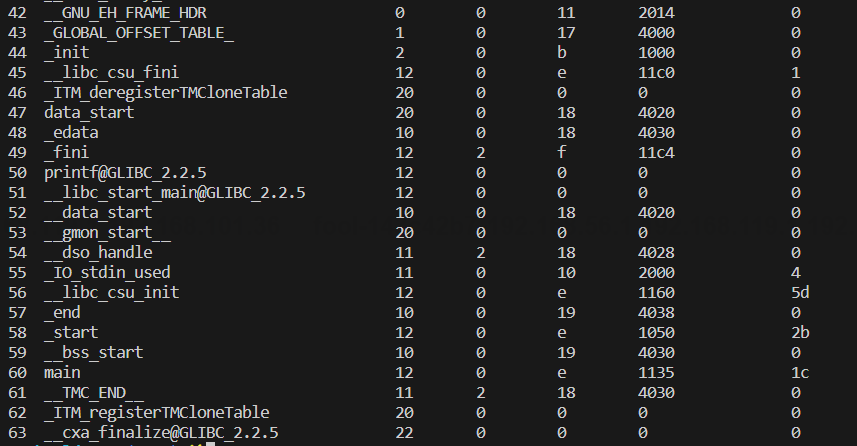
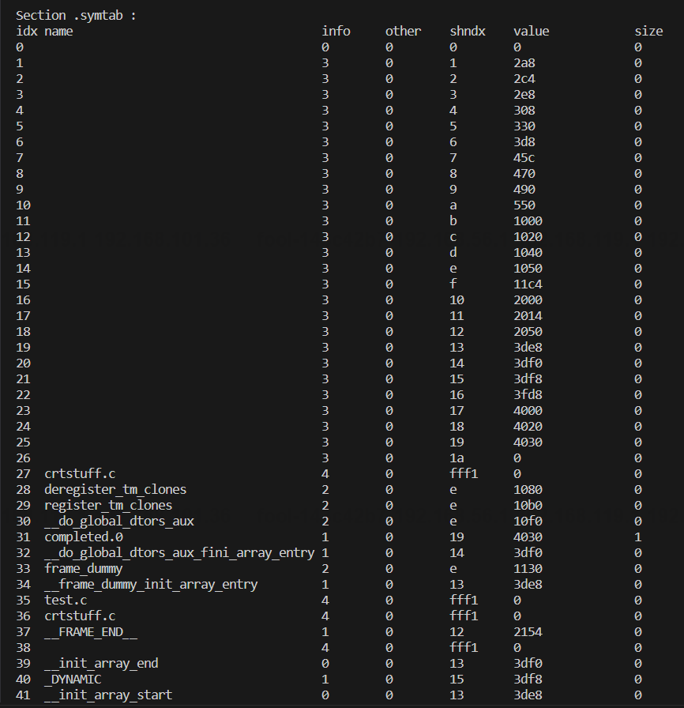
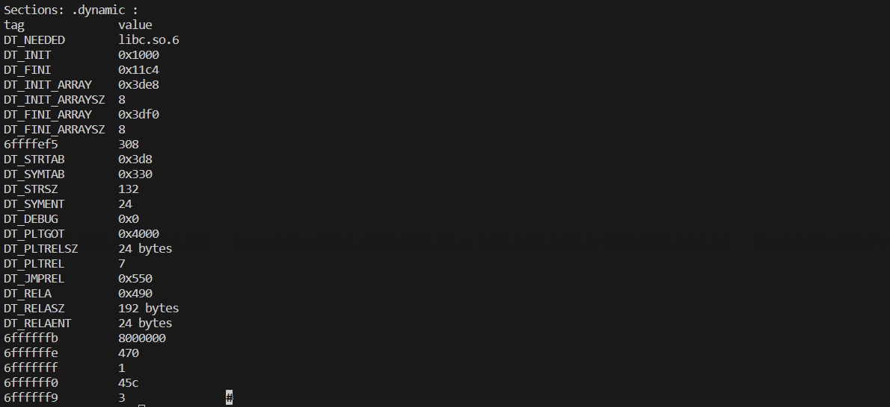
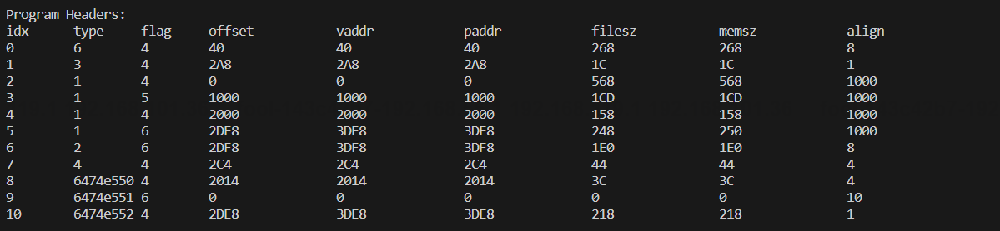

# 关于本仓库

在学习ELF文件格式过程中写的小Demo

通过使用**GNU/GCC** usr/include/elf.h头文件进行ELF文件的解析

# 输出

> ELF Header

> ELF Section Headers

> Symbol Table

- .dynsym section

- .symtab section

> Relocation

> .dynamic

> Program Header

